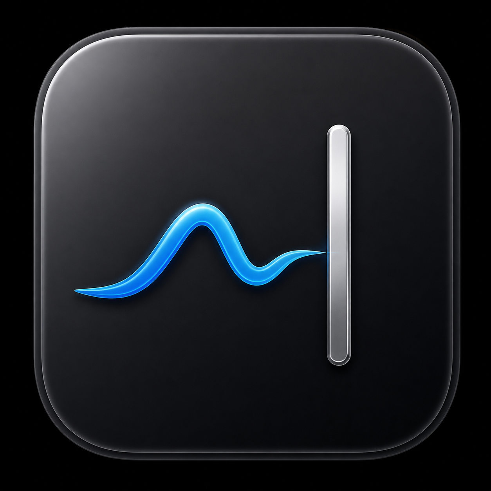
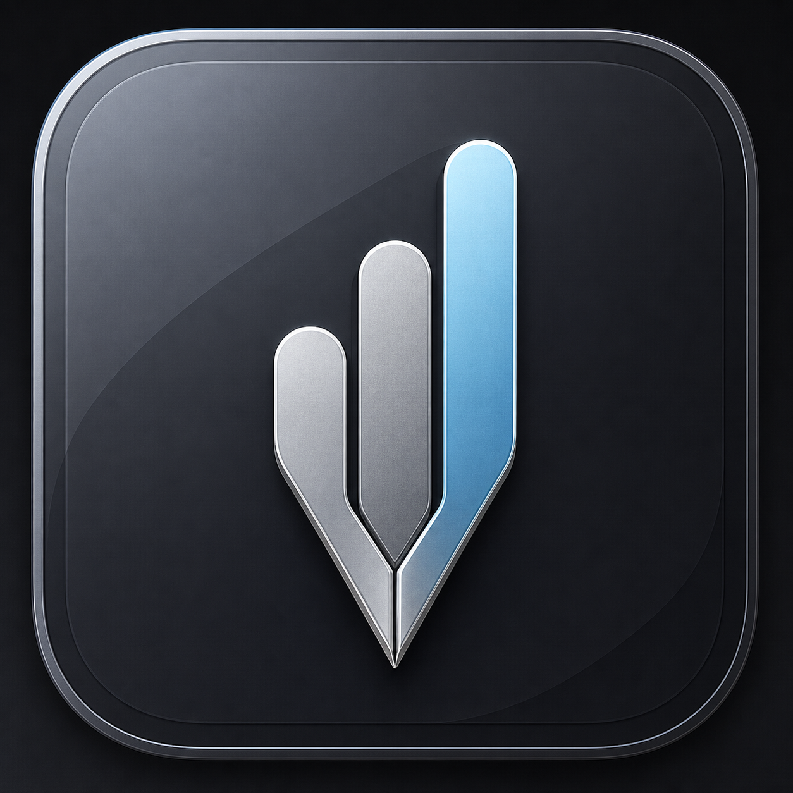
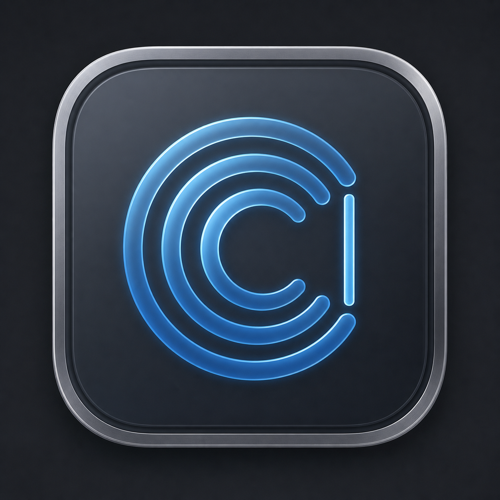

# Saymark icon concepts

These are exploratory raster previews generated for direction-setting. They are not production masters and should not be placed in the asset catalog without a geometric redraw, small-size testing, and an App Store similarity review.

## Concept 01 — Wave to caret

The recommended direction. A spoken trace becomes the cursor where Saymark writes.

## Concept 02 — Voice mark

Three sound bars converge into a writing point. Compact, but the current execution risks reading as arrows or a nib.

## Concept 03 — Ripple caret

A listening ripple opens into a caret. It communicates live capture but is less ownable and less legible at small sizes.

## Generation prompts

All three previews were generated with the built-in image-generation workflow as original `logo-brand` explorations. No competitor art or logo was used as input.

### Concept 01

> Create an original, premium macOS app icon showing spoken audio becoming a precise written mark. The central symbol is a single fluid cool-blue sound stroke on the left that resolves into a crisp vertical text insertion caret on the right, unified as one simple glyph. Use a graphite glass rounded-square tile, restrained native macOS materials, subtle satin chrome, and generous padding. No text, mascot, microphone, headphones, warm colors, purple gradients, excessive glow, or competitor resemblance.

### Concept 02

> Create an original premium macOS icon built around a compact voice mark: three ascending rounded sound bars that smoothly converge into a sharp downward pen point, suggesting speech becoming writing. Use deep neutral graphite glass, satin aluminum, and a desaturated cyan-blue accent. Keep the silhouette simple at menu-bar size. No text, mascot, microphone, check mark, warm colors, rainbow, or generic equalizer grid.

### Concept 03

> Create an original premium macOS app icon with a continuous abstract speech glyph: a cool-blue circular sound ripple opens on the right and terminates as a slim vertical text caret, suggesting live speech flowing into the cursor. Use a deep graphite frosted-glass tile, satin aluminum, restrained depth, and a simple centered silhouette. No text, mascot, microphone, sparkles, warm colors, loud neon, power-button resemblance, or competitor resemblance.

